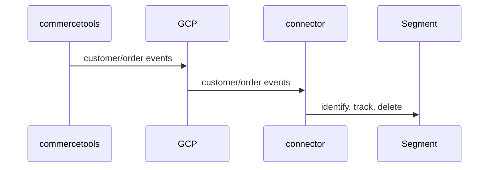

# commercetools-segment-connector

This connector uses commercetools subscriptions to send customer and order data to Twilio Segment.

## Overview

The diagram below provides an overview of the integration.



## Prerequisites

1. commercetools composable commerce [account](https://commercetools.com/free-trial)
2. Segment [account](https://segment.com/signup)
3. A Node.js source setup in Segment. See [Quickstart: Node.js](https://segment.com/docs/connections/sources/catalog/libraries/server/node/quickstart/). You will need your `Write Key` from the source settings.
4. A Segment Public API Token (optional). This is only available on paid plans and is required for user deletion. See Customer Deletion section below.

## Events

This connector handles the following commercetools events:

- `customer`: `ResourceCreated`, `ResourceUpdated`, `ResourceDeleted`
- `order`: `ResourceCreated`

### Customer Creation/Updates

An `identify` call will be made to Segment when a customer is created or updated in commercetools. This follows the [Segment spec](https://segment.com/docs/connections/spec/identify/).

The customer ID and update version number are used as the `messageId` to ensure any duplicate events from commercetools are not duplicated in Segment.

### Customer Deletion

A call to Segment’s Public API is made to request the deletion of a user when they are deleted in commercetools. The `SUPPRESS_WITH_DELETE` option is used to ensure that the user ID is removed from Segment and any future events are suppressed.

Note, this call just requests the deletion. You can see the state of the deletion in the Segment UI.

We can only make this call with a Public API token. This is marked as optional in the configuration as it is only available on paid plans (although there is a free trial period for paid plans).

See [User Deletion and Suppression](https://segment.com/docs/privacy/user-deletion-and-suppression/) for more details.

### Order Creation

An `Order Completed` tracking event is sent to segment when an order is created in commercetools. It follows the [Segment spec](https://segment.com/docs/connections/spec/ecommerce/v2/#order-completed). Below are details on the value properties.

- `total` - gross total of the order (includes shipping and taxes).
- `subtotal` - net total (without tax) of the order without shipping.
- `discount` - gross total discount amount of the order.
- `shipping` - gross total shipping cost of the order.
- `tax` - total amount of tax applied to the order.

**Products**

- `price` - unit price of the item (for a single quantity). This includes any product discounts, but not cart discounts.
- `total_price` - this is for the entire quantity of the item and includes any item discounts. Note, this is not a standard property in Segment spec, but provided in case this needs to be passed to a destination.

Depending on the destination you are sending the events to, you may need to edit the mapping configuration in Segment. **Review these values carefully to ensure they are correct for your use case.**

We use `[orderId]-order-completed` as the `messageId` to ensure any duplicate order created events from commercetools are not duplicated in Segment.

## Anonymous Orders

For anonymous/guest account orders, an `Identify` call will be made if there is no registered account for the email address on the order. This is only done if the email address is not already registered in commercetools because otherwise guest account orders (where the email hasn't been verified) would be attached to a registered account.

Note. Segment only accepts events with either an anonymous ID or a user ID, so it is important to ensure anonymous carts have an anonymous ID set before converting to an order. Otherwise these orders won't be able to be tracked in Segment.

## Compatibility with other Segment Tracking

If you are using Segment, you are likely to be implementing tracking on your website/apps to track browsing and other events.

In this case, we would recommend using the same anonymous ID on the cart as other tracking code. This will ensure the tracking works as expected between this connector and the other tracking.

In the case of [Segment Analytics.js Source](https://segment.com/docs/connections/sources/catalog/libraries/website/javascript/) you can either pass your anonymous ID to Segment or let Segment generate the anonymous ID and use that.

Implementing this tracking will allow anonymous orders to be associated with a registered account if the customer subsequently signs in or registers in the same browser. See [Best Practices for Identifying Users](https://segment.com/docs/connections/spec/best-practices-identify/) for more details.

## Consent

Segment supports a consent object "to stamp events with the end user consent preferences captured by your consent management platform (CMP)". See [Consent in Segment Connections](https://segment.com/docs/privacy/consent-management/consent-in-segment-connections/)

When using this model, all events need this consent object.

This connector will look for a custom field on a customer and order to get the consent object. The default field name is `consent` but this can be changed in the configuration. The field should be of type `String` and contain a JSON serialised version of the object you want to send in the Segment `consent` object.

For order events, we look for the field on an order rather than a customer because orders can be anonymous (without a registered customer). You should set the content field on the cart before the order is created.

Note, this connector does not create these custom fields. This is due to the fact commercetools only allows one custom type to be set on a resource at a time. So if you have existing custom types for customers and orders you will need to add it to those types or create new types.

See this tutorial for details: [Use Types and Custom Fields](https://docs.commercetools.com/tutorials/custom-types)

An example curl request for creating a custom field on a customer is below.

```bash
curl "https://api.europe-west1.gcp.commercetools.com/${PROJECT_KEY}/types" \
--header "Authorization: Bearer ${BEARER_TOKEN}" \
--header 'Content-Type: application/json' \
--data-binary @- << DATA
{
  "key": "customer-consent",
  "name": { "en": "JSON field for consent" },
  "resourceTypeIds": ["customer"],
  "fieldDefinitions": [
    {
      "type": {
        "name": "String"
      },
      "name": "consent",
      "label": {
        "en": "Consent"
      },
      "required": false,
      "inputHint": "SingleLine"
    }
  ]
}
DATA
```

The same approach can be used to create a custom field on an order.

## Running the Connector locally

### Prerequisite: GCP Pub/Sub

To run an event based connect application locally, you need to setup a GCP Pub/Sub topic and subscription. When running in connect this is done for you.

Make sure the topic has permissions for `subscriptions@commercetools-platform.iam.gserviceaccount.com` to publish to the topic.

### Steps

- Create an API Client in commercetools with the following scopes: `view_orders`, `view_customers` and `manage_subscriptions`
- `cd` into the `event-handler` directory
- Set up a local .env file as per `.env.example` (using your commercetools API client, GCP Pub/Sub topic and Segment details)
- Run `yarn` to install the dependencies
- Run `yarn build` to build the project
- Run `yarn connector:post-deploy` to create the subscription in commercetools.
- Run the event service by running `yarn dev` in the `event-handler` directory. This will start a local server on port 8080.
- Use a HTTP tunnel tool like ngrok to expose the local server to the internet. E.g. `ngrok http 8080` (note you can get a consistent domain from the ngrok dashboard which will provide a consistent domain rather than auto-generating a new one each time).
- Create a subscription in GCP Pub/Sub for the topic you created above. Use the ngrok URL as the endpoint for the subscription. E.g. `https://[Your ngrok ID].ngrok-free.app/`

See the [connect-email-integration-template](https://github.com/commercetools/connect-email-integration-template/blob/fdc6689e7a53f9f72e05a38d41ea805ad94b8911/mail-sender/README.md?plain=1#L174) for other instructions on how to run the connector locally
